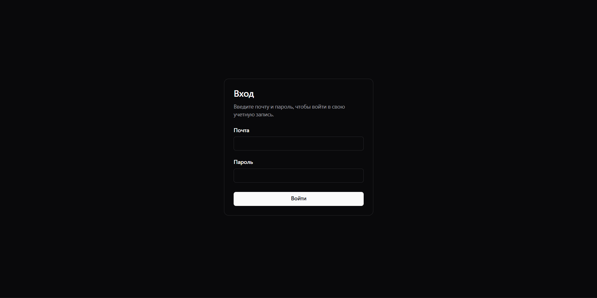
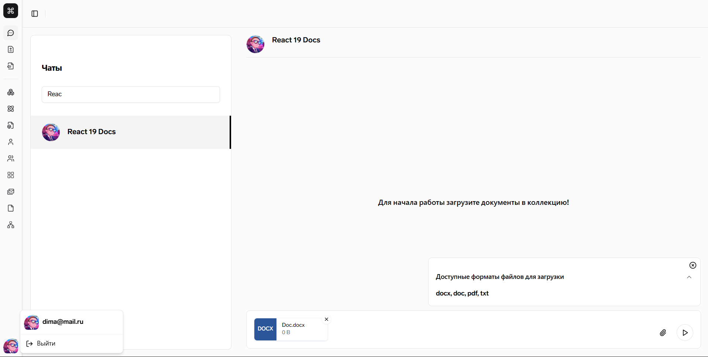
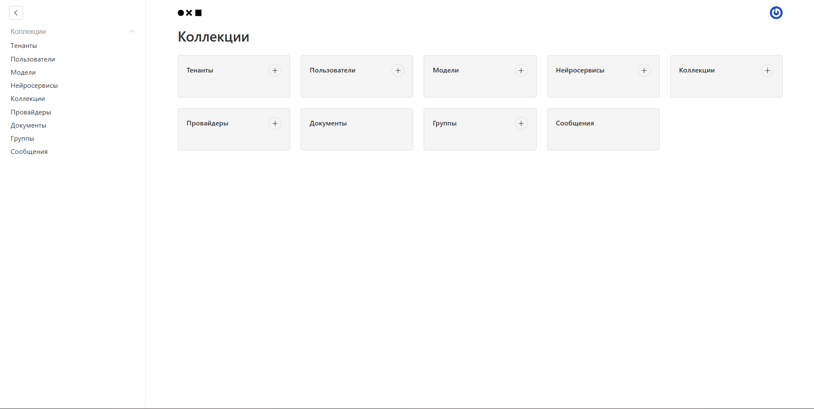
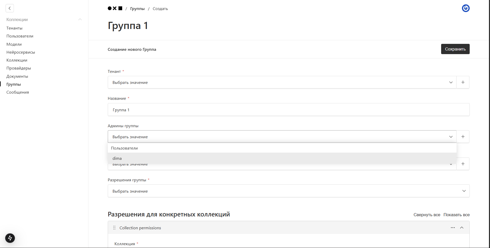

# AI Assistant

Fullstack TypeScript monorepo for an AI-assisted web platform with a public web app, admin panel, backend package, auth service and shared workspace packages.

The project is focused on modular architecture, shared code, reusable tooling configuration and separate frontend/backend workspaces inside one repository.

## Interface examples

### Login page



### Main chat interface



### Admin panel



### Admin operations



## What is inside

- Public web application
- Admin panel based on Payload CMS
- Backend package based on NestJS
- Auth service module
- Shared packages for common code and tooling configs
- PostgreSQL, Redis and S3-related integrations
- Docker-related configuration
- CI/CD configuration
- Tests, linting and formatting setup

## Tech stack

### Frontend

- React
- TypeScript
- Vite
- Tailwind CSS
- Radix UI
- TanStack Table
- React Hook Form
- Axios
- Biome

### Admin and CMS

- Next.js
- Payload CMS
- PostgreSQL adapter
- Lexical rich text editor
- Payload UI
- Role-based and access-control logic
- S3-compatible media storage integration

### Backend

- Node.js
- NestJS
- MikroORM
- PostgreSQL
- Redis
- Passport
- Swagger
- S3-compatible storage
- Vitest

### Infrastructure and tooling

- pnpm workspaces
- Turborepo
- Docker
- GitLab CI
- TypeScript
- TSUP
- Lefthook
- Biome

## Repository structure

```txt
apps/
  web/          Public web application
  admin/        Admin panel and Payload CMS application

services/
  auth/         Auth service module

packages/
  backend/      Backend package
  common/       Shared code
  configs/      Shared tooling configs

docker/         Docker-related configuration
```

## Main scripts

Install dependencies:

```bash
pnpm install
```

Run web app:

```bash
pnpm dev:web
```

Run admin panel:

```bash
pnpm dev:admin
```

Run backend:

```bash
pnpm dev:backend
```

Run tests:

```bash
pnpm test
```

Run linting:

```bash
pnpm lint
```

Format code:

```bash
pnpm format
```

Build web app:

```bash
pnpm build:web
```

Build admin panel:

```bash
pnpm build:admin
```

Build backend:

```bash
pnpm build:backend
```

## Development notes

The project uses a monorepo structure to keep frontend, admin, backend and shared packages in one repository.

This makes it easier to reuse types, utility code, validation logic and tooling configuration between different parts of the system.

Turborepo is used to orchestrate workspace tasks such as build, lint, test and development commands. pnpm workspaces are used for dependency management.

## What I focused on in this project

- Building a fullstack TypeScript monorepo
- Organizing frontend, backend and admin apps in one workspace
- Creating shared packages for common logic and configs
- Working with React and Vite on the client side
- Working with Next.js and Payload CMS for the admin panel
- Working with NestJS backend architecture
- Connecting backend logic with PostgreSQL, Redis and S3-compatible storage
- Setting up local development scripts, builds, linting and tests
- Preparing Docker and CI/CD-related configuration
- Keeping the codebase modular and easier to extend

## Status

Part of a real fullstack project.

The repository is mainly intended to demonstrate experience with TypeScript, React, NestJS, Payload CMS, monorepo architecture and backend/frontend integration.
